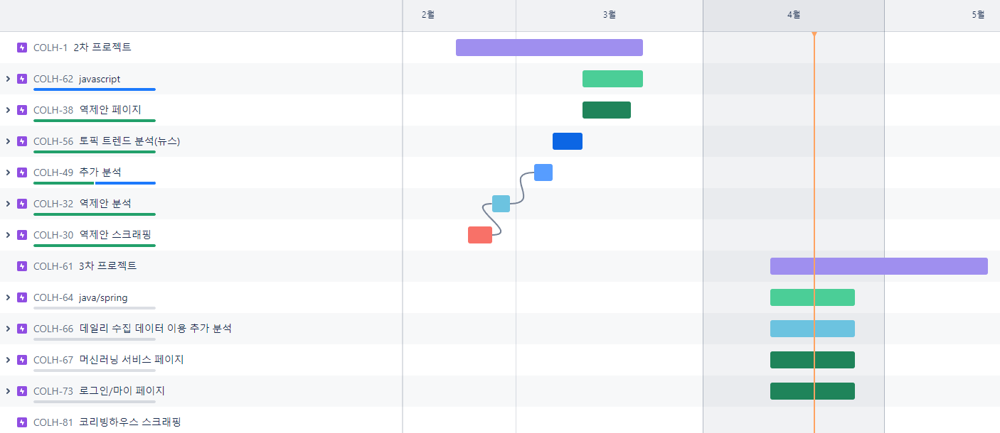
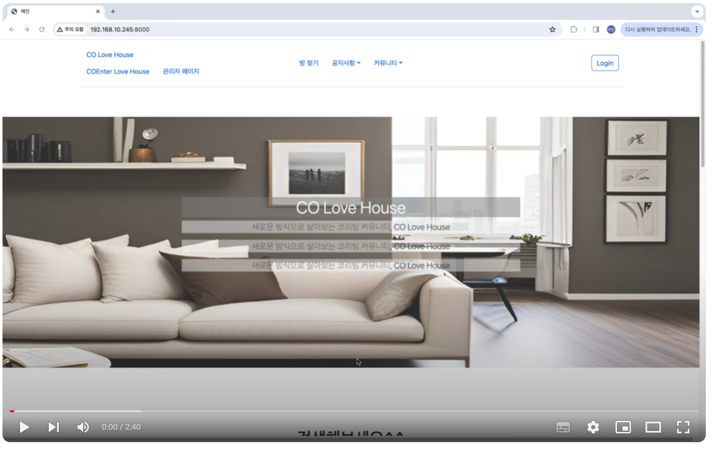

# CO Love House 프로젝트♡

### ■ 팀명 : 속세를 떠나고 싶다

### ■ 프로젝트 기간
---
 - 1차 : 2023.01.08 - 2024.01.17
 - 2차 : 2023.02.21 - 2024.03.21
 
## ☑ 사용기술
  

   

  

### 구성원
---
|이름|역할|
|--|--|
|장영지|PM, 데이터분석, 웹 스크래핑, 프론트엔드, 백엔드|
|김유진|데이터분석, 웹 스크래핑|
|공명윤|프론트엔드, 백엔드|
|박요한|데이터분석, 웹 스크래핑|

### ■ 사이트 : [CO Love House](http://192.168.10.245:8000/)

### ■ 프로젝트 소개
---
   1. 1~2인 가구를 위한 주거 공간을 빠르게 검색하기 위한 코리빙하우스 플랫폼
   2. 투어하기 예약 및 이용자들의 후기 확인
   3. 커뮤니티에서 글쓰기, 검색, 삭제 기능
   4. 관리자 - 회원관리, 매물관리

### ■ [스케쥴러 JIRA 사용](https://waity0912.atlassian.net/jira/software/projects/COLH/boards/2/timeline?timeline=MONTHS)

### ■ 플랫폼 reference
- [동거동락](https://dgdr.co.kr/main/main.html)
- [쉐어하우스 우주](https://www.woozoo.kr/)

### 📚 웹 스크래핑 대상
- [디어스 판교](https://dears.kr/ko)
- [디어스 명동](https://www.dearsmd.com/)
- [맹그로브](https://mangrove.city/)
- [하품](https://www.hapoom.co/)
- [커먼시티](https://www.commontown.co/ko)
- [에피소드](https://www.epsd.co.kr/ep369/)
- [셀립](https://celib.kr/)
- [업플로](https://www.upflo.kr/about)
- [에피소드](https://www.epsd.co.kr/)
- [로컬스티치](https://localstitch.kr/)
- [콤피](http://comfi-stay.com/)
- [홈즈스튜디오](https://www.homes-studio.kr/Urbanhouse_)
- [헤이](https://www.heyy.co.kr/spotView/7)
- [리브라이프](https://live-life.kr/)

### 📚 사용 collection
---
|컬렉션|각 key값|
|--|--|
|ROOM_DATA|room_brand, room_local, room_image, room_image_two, room_title, room_type, room_any, room_size, room_layout, room_option, room_default_option, room_note|
|ENTER_ROOM_DATA|address, dong_address, ho_adress, price|
|USER_DATA|name, email, password, phonenumber|
|ENTER_USER_DATA|name, email, password, phonenumber, enter_number|
|NOTICE_DATA|notice_title, notice_text|
|REVIEW_DATA|review_title, review_content, review_image|

## 💻 프로젝트 진행
- [Naming Rule](https://docs.google.com/spreadsheets/d/1pgseXMtVbRS0Qu6j2i6_T3EC-cICqrJl/edit#gid=1553145129) 
- [Program List](https://docs.google.com/spreadsheets/d/177dosTpc5QXqKI9N2E94pvYRHJ3T5lHF/edit#gid=389956398)
- [Screen Definition](https://app.diagrams.net/#G13JhyVSufPlX4SV4WNJss9p5QtiRxywyE)
- [의뢰서](https://docs.google.com/presentation/d/1jXnKIb6BObgcawwsQxdnuJaKzaEq_aynAtOu1oHNn7U/edit#slide=id.p1)
- [DB구성](images/main.png)
- [요구사항 정의서](https://docs.google.com/spreadsheets/d/1PaTjeLzbWQcow_RhyxXIo4exBDXDtT7A/edit#gid=1623924950)

---

### ■ 팀원별 구현 기능(2차)
|이름|웹|데이터 분석|
|--|--|--|
|장영지|google chart 적용|지역당 평균 가격(보증금, 월세) 분석, roomType별 가격 분포 비교 분석, 코리빙과 일반 부동산 매물 평균 매출시장규모 분석|
|김유진||평당 평균 가격 차이에 대한 정규분포 검증|
|공명윤|javascript fetch, rich editor 적용||
|박요한||토픽 트렌드 분석(뉴스)|

### ■ 데이터 분석 결과
- 

---
### 🎥 [1차 구현 영상](https://www.youtube.com/watch?v=DL7DeUd5Dhg)

### 🎥 [2차 구현 영상](https://www.youtube.com/watch?v=3dtHwzV1gOg&feature=youtu.be)

